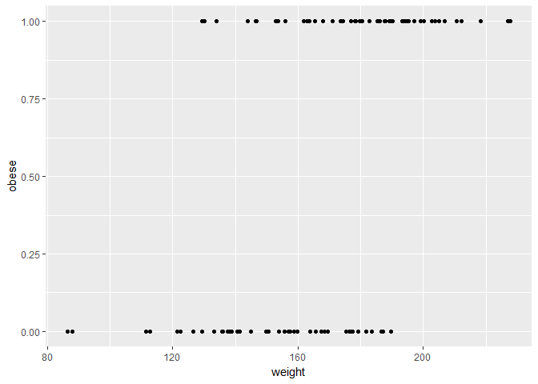
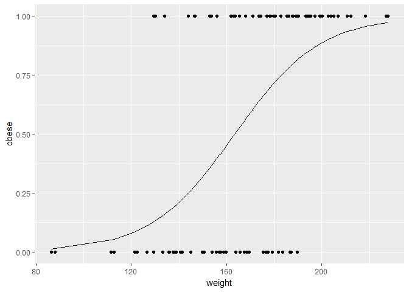
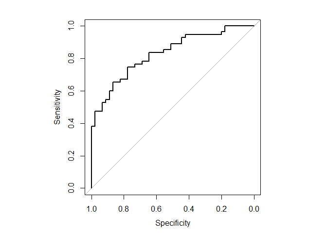
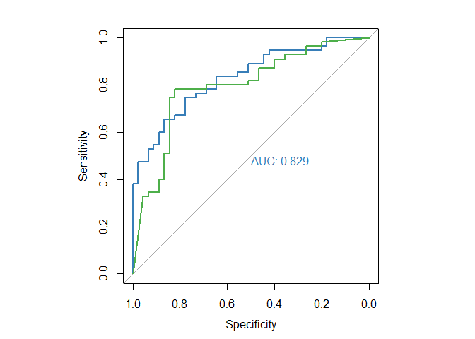

ROC-AUC\_curve
================
Christoper Chan
January 20, 2019

``` r
library(tidyverse)
library(randomForest)
library(pROC)
```

Creating the data.

``` r
set.seed(420)

n_samples <- 100
weight <- sort(rnorm(n_samples, 172, 29))

obese <- ifelse(runif(n_samples) < rank(weight)/100, 1, 0)
```

Plotting the data.

``` r
temp <- tibble(weight, obese)

log_plot <- ggplot(temp, aes(weight, obese)) + 
    geom_point()
log_plot
```



Creating the model.

``` r
glm_fit <- glm(obese~weight, family=binomial)

log_plot + geom_line(aes(weight, glm_fit$fitted.values))
```



``` r
par(pty = 's')
roc_info <- roc(obese, glm_fit$fitted.values, plot=T)
```



``` r
roc_df <- tibble(tpp=roc_info$sensitivities*100,
                 fpp=(1-roc_info$specificities)*100,
                 thresholds=roc_info$thresholds)

head(roc_df)
```

    ## # A tibble: 6 x 3
    ##     tpp   fpp thresholds
    ##   <dbl> <dbl>      <dbl>
    ## 1  100. 100.   -Inf     
    ## 2  100.  97.8     0.0135
    ## 3  100.  95.6     0.0325
    ## 4  100.  93.3     0.0525
    ## 5  100.  91.1     0.0702
    ## 6  100.  88.9     0.0880

``` r
tail(roc_df)
```

    ## # A tibble: 6 x 3
    ##     tpp   fpp thresholds
    ##   <dbl> <dbl>      <dbl>
    ## 1  9.09    0.      0.928
    ## 2  7.27    0.      0.937
    ## 3  5.45    0.      0.948
    ## 4  3.64    0.      0.965
    ## 5  1.82    0.      0.974
    ## 6  0.      0.    Inf

Graphing 2 ROC curves.

``` r
rf_model <- randomForest(factor(obese)~weight)
```

``` r
par(pty = 's')
roc(obese, glm_fit$fitted.values, plot=T, col='#377eb8', print.auc=T)
```

    ## 
    ## Call:
    ## roc.default(response = obese, predictor = glm_fit$fitted.values,     plot = T, col = "#377eb8", print.auc = T)
    ## 
    ## Data: glm_fit$fitted.values in 45 controls (obese 0) < 55 cases (obese 1).
    ## Area under the curve: 0.8291

``` r
plot.roc(obese, rf_model$votes[,1], add=T, col='#4daf4a', print.auc=T, print.auc.y=-80)
```



``` r
par(pty='m')
```
