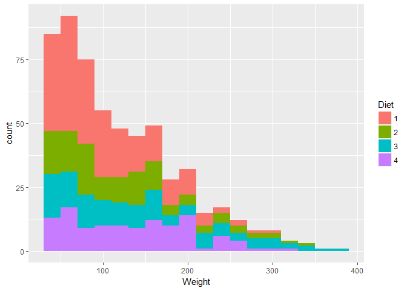

R Notebook
================

``` r
library(tidyverse)
library(broom)
library(glmnet)
```

``` r
st <- storms

head(st)
```

    ## # A tibble: 6 x 13
    ##   name   year month   day  hour   lat  long status category  wind pressure
    ##   <chr> <dbl> <dbl> <int> <dbl> <dbl> <dbl> <chr>  <ord>    <int>    <int>
    ## 1 Amy   1975.    6.    27    0.  27.5 -79.0 tropi~ -1          25     1013
    ## 2 Amy   1975.    6.    27    6.  28.5 -79.0 tropi~ -1          25     1013
    ## 3 Amy   1975.    6.    27   12.  29.5 -79.0 tropi~ -1          25     1013
    ## 4 Amy   1975.    6.    27   18.  30.5 -79.0 tropi~ -1          25     1013
    ## 5 Amy   1975.    6.    28    0.  31.5 -78.8 tropi~ -1          25     1012
    ## 6 Amy   1975.    6.    28    6.  32.4 -78.7 tropi~ -1          25     1012
    ## # ... with 2 more variables: ts_diameter <dbl>, hu_diameter <dbl>

``` r
summary(st)
```

    ##      name                year          month             day       
    ##  Length:10010       Min.   :1975   Min.   : 1.000   Min.   : 1.00  
    ##  Class :character   1st Qu.:1990   1st Qu.: 8.000   1st Qu.: 8.00  
    ##  Mode  :character   Median :1999   Median : 9.000   Median :16.00  
    ##                     Mean   :1998   Mean   : 8.779   Mean   :15.86  
    ##                     3rd Qu.:2006   3rd Qu.: 9.000   3rd Qu.:24.00  
    ##                     Max.   :2015   Max.   :12.000   Max.   :31.00  
    ##                                                                    
    ##       hour             lat             long            status         
    ##  Min.   : 0.000   Min.   : 7.20   Min.   :-109.30   Length:10010      
    ##  1st Qu.: 6.000   1st Qu.:17.50   1st Qu.: -80.70   Class :character  
    ##  Median :12.000   Median :24.40   Median : -64.50   Mode  :character  
    ##  Mean   : 9.114   Mean   :24.76   Mean   : -64.23                     
    ##  3rd Qu.:18.000   3rd Qu.:31.30   3rd Qu.: -48.60                     
    ##  Max.   :23.000   Max.   :51.90   Max.   :  -6.00                     
    ##                                                                       
    ##  category       wind           pressure       ts_diameter     
    ##  -1:2545   Min.   : 10.00   Min.   : 882.0   Min.   :   0.00  
    ##  0 :4373   1st Qu.: 30.00   1st Qu.: 985.0   1st Qu.:  69.05  
    ##  1 :1685   Median : 45.00   Median : 999.0   Median : 138.09  
    ##  2 : 628   Mean   : 53.49   Mean   : 992.1   Mean   : 166.76  
    ##  3 : 363   3rd Qu.: 65.00   3rd Qu.:1006.0   3rd Qu.: 241.66  
    ##  4 : 348   Max.   :160.00   Max.   :1022.0   Max.   :1001.18  
    ##  5 :  68                                     NA's   :6528     
    ##   hu_diameter    
    ##  Min.   :  0.00  
    ##  1st Qu.:  0.00  
    ##  Median :  0.00  
    ##  Mean   : 21.41  
    ##  3rd Qu.: 28.77  
    ##  Max.   :345.23  
    ##  NA's   :6528

Getting the number of storms recorded and how many of each status type there are.

``` r
st$name %>%
    unique() %>%
    length()
```

    ## [1] 198

``` r
count(st, status)
```

    ## # A tibble: 3 x 2
    ##   status                  n
    ##   <chr>               <int>
    ## 1 hurricane            3091
    ## 2 tropical depression  2545
    ## 3 tropical storm       4374

This is which storms turn into a hurricane. I'm not sure how to do this with 1 pipe, so I just used 2.

``` r
hu <- st %>%
    filter(status == 'hurricane')
```

    ## Warning: package 'bindrcpp' was built under R version 3.4.4

``` r
hu_names <- hu$name %>% 
    unique()
cat('There are:', length(hu_names), 'hurricanes.')
```

    ## There are: 121 hurricanes.

``` r
ggplot(st, aes(lat, long, color=status)) +
    geom_point()
```


``` r
ggplot(st, aes(lat, long, color = year)) +
    geom_line()
```


``` r
cw <- ChickWeight

cw <- as.tibble(cw) %>%
    rename(Weight = weight)
```

Question: Find the number of Chick in each Diet

``` r
#Count by itself does not work because each Chick has multiple rows. Instead we must filter out the 
count(cw, Diet)
```

    ## # A tibble: 4 x 2
    ##   Diet      n
    ##   <fct> <int>
    ## 1 1       220
    ## 2 2       120
    ## 3 3       120
    ## 4 4       118

``` r
a <- cw %>%
    select(Chick, Diet)

b <- a[!duplicated(a$Chick),]

count(b, Diet)
```

    ## # A tibble: 4 x 2
    ##   Diet      n
    ##   <fct> <int>
    ## 1 1        20
    ## 2 2        10
    ## 3 3        10
    ## 4 4        10

More concise way of doing it.

``` r
t <- cw %>% distinct(Chick, Diet) %>% count(Diet)
t
```

    ## # A tibble: 4 x 2
    ##   Diet      n
    ##   <fct> <int>
    ## 1 1        20
    ## 2 2        10
    ## 3 3        10
    ## 4 4        10

``` r
ggplot(cw, aes(Time, Weight, color=Diet)) +
    geom_point()
```


``` r
ggplot(cw, aes(Diet, Weight)) +
    geom_boxplot() +
    geom_jitter(aes(color=Diet), width=0.5)
```


``` r
ggplot(cw, aes(Weight, fill=Diet)) +
    geom_histogram(position='stack', binwidth=20)
```



``` r
ggplot(cw, aes(Weight, fill=Diet)) +
    geom_density(alpha=0.40)
```


``` r
cw %>%
    head
```

    ## # A tibble: 6 x 4
    ##   Weight  Time Chick Diet 
    ##    <dbl> <dbl> <ord> <fct>
    ## 1    42.    0. 1     1    
    ## 2    51.    2. 1     1    
    ## 3    59.    4. 1     1    
    ## 4    64.    6. 1     1    
    ## 5    76.    8. 1     1    
    ## 6    93.   10. 1     1

Stuff to do. 1) Create a linear model for each of the diets. 2) Run ANOVA on each of them 3) Find visualizes I can create based on time.

1.  Linear model. I would create a linear model for each diet. Predictor variable=time, Response=weight. I'll preform CV on them and just graph the model. I'm going to nest the rest of the data in the categorical variable of Diet. And then preform a lm on each nested dataset. I'm creating two col, model and results. I then unnest results and it shows up in the nt df.

``` r
nt <- cw %>%
    nest(-Diet) %>%
    mutate(model = map(data, ~ lm(Weight~Time, data=.)),
            results = map(model, glance)) %>%
    unnest(results)

nt
```

    ## # A tibble: 4 x 14
    ##   Diet  data  model r.squared adj.r.squared sigma statistic  p.value    df
    ##   <fct> <lis> <lis>     <dbl>         <dbl> <dbl>     <dbl>    <dbl> <int>
    ## 1 1     <tib~ <S3:~     0.665         0.664  32.8      434. 9.81e-54     2
    ## 2 2     <tib~ <S3:~     0.669         0.666  41.4      239. 4.04e-30     2
    ## 3 3     <tib~ <S3:~     0.807         0.805  38.2      492. 6.56e-44     2
    ## 4 4     <tib~ <S3:~     0.906         0.905  21.2     1119. 2.04e-61     2
    ## # ... with 5 more variables: logLik <dbl>, AIC <dbl>, BIC <dbl>,
    ## #   deviance <dbl>, df.residual <int>

Analysis of the models.

``` r
ggplot(nt, aes(Diet, adj.r.squared)) +
    geom_bar(stat='identity')
```

 Need to figure out how to graph nested dataframes. Just unnest? <https://stackoverflow.com/questions/47482288/how-to-use-purrrpmap-to-plot-multiple-ggplot-in-nested-data-frame> <https://rstudio-pubs-static.s3.amazonaws.com/31907_99e9f2fba28441d5a208587d656592d2.html>

ggplot(nt, aes(data\[\[1\]\]*T**i**m**e*, *d**a**t**a*\[\[1\]\]Weight)) + geom\_point()
